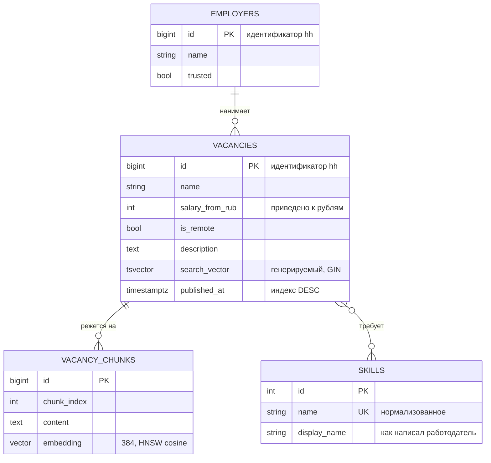

# hh-radar

[](https://github.com/Denmurzik/hh-radar/actions/workflows/ci.yml)
[](pyproject.toml)
[](LICENSE)

**Своя база вакансий hh.ru, которую LLM-агент опрашивает как набор инструментов.**
Полнотекстовый поиск на PostgreSQL, поиск по смыслу на pgvector, семь MCP-инструментов
и честный замер того, где поиск ошибается.

📊 **[Витрина: срез рынка AI и автоматизации](https://denmurzik.github.io/hh-radar/)** — открывается за десять секунд, все цифры посчитаны программой из базы.

---

## Зачем это написано

Я искал работу через hh.ru и делал руками одно и то же: открыть выдачу, прочитать
тридцать описаний, выписать, какие навыки повторяются, прикинуть, куда вообще есть
смысл писать. Поиск на hh отвечает на «есть ли слово в тексте». На вопросы, которые
возникали у меня — «где чаще всего просят n8n и сколько за это платят», «какие
вакансии возьмут человека без коммерческого опыта», «где нужно чинить чужие сломанные
автоматизации» — он не отвечает вообще.

Поэтому вакансии складываются в свою базу, а поверх базы стоит MCP-сервер. Дальше
вопрос задаётся обычными словами прямо в Claude Desktop, а агент сам решает, чем его
обслужить: полнотекстовым поиском, агрегацией по навыкам, срезом зарплат или поиском
по смыслу.

```
Ты: какие навыки чаще всего требуют в вакансиях по автоматизации за последний месяц?

Claude вызывает skill_stats(query="автоматизация", published_within_days=30)
→ Python — 61% вакансий, медиана 140 000 ₽
  n8n — 34%, медиана 150 000 ₽
  Docker — 29%, ...
```

Цифры в примере — иллюстрация формата ответа. Настоящие лежат на витрине и меняются
с каждым сбором.

## Что внутри

| Слой | Что делает |
|---|---|
| `hh/` | Клиент API hh.ru: OAuth-токен приложения, ограничение частоты, ретраи, обход потолка выдачи |
| `ingest/` | Идемпотентная запись в базу: UPSERT, двухфазная загрузка карточек |
| `db/` | Схема на четыре таблицы, полнотекстовый индекс, слой запросов |
| `rag/` | Чанкинг, эмбеддинги, поиск по смыслу на pgvector, гибридный поиск, **оценка качества** |
| `mcp_server/` | Семь инструментов для LLM-агента поверх всего перечисленного |
| `showcase/` | Генератор статической витрины для GitHub Pages |

### Инструменты MCP

| Инструмент | Отвечает на вопрос |
|---|---|
| `search_vacancies` | «Найди вакансии со словами X, удалённо, от 150 тысяч» |
| `semantic_search` | «Найди вакансии, где надо чинить чужие сломанные автоматизации» |
| `get_vacancy` | «Покажи эту вакансию целиком» |
| `skill_stats` | «Какие навыки требуют чаще всего и сколько за них платят» |
| `market_overview` | «Какая вилка на рынке, сколько удалёнки, кто больше всех нанимает» |
| `compare_to_profile` | «Мне сюда стоит писать?» — с честным ответом «нет, и вот почему» |
| `db_status` | «Что вообще есть в базе и за какой период» — чтобы агент не выдумывал |

## Быстрый старт

Нужны Docker и Python 3.12+.

```bash
git clone https://github.com/Denmurzik/hh-radar
cd hh-radar

uv sync --extra rag          # или: pip install -e ".[rag]"
docker compose up -d db      # PostgreSQL 17 + pgvector на порту 5433
uv run alembic upgrade head  # схема
uv run hh-radar seed         # примеры вакансий, без токена и без сети
uv run hh-radar status
```

Через минуту у вас работающая база и MCP-сервер. Дальше — либо подключить его к
Claude Desktop (см. ниже), либо собрать настоящие данные.

### Настоящие данные

`GET /vacancies` у hh **закрыт для анонимных запросов** — отвечает
`403 bad_authorization`. Нужен токен приложения:

1. Зайдите на [dev.hh.ru/admin](https://dev.hh.ru/admin) → «Создать приложение».
2. Скопируйте Client ID и Client Secret.
3. `cp .env.example .env` и впишите их в `HH_CLIENT_ID` / `HH_CLIENT_SECRET`.

Токен по `client_credentials` запрашивается автоматически и кэшируется на диск —
`/token` не дёргается на каждый запуск.

```bash
uv run hh-radar ingest --days 30      # собрать вакансии
uv run hh-radar index                 # посчитать эмбеддинги
uv run hh-radar showcase              # пересобрать витрину
```

### Подключение к Claude Desktop

`%APPDATA%\Claude\claude_desktop_config.json` (Windows) или
`~/Library/Application Support/Claude/claude_desktop_config.json` (macOS):

```json
{
  "mcpServers": {
    "hh-radar": {
      "command": "C:\\путь\\к\\hh-radar\\.venv\\Scripts\\python.exe",
      "args": ["-m", "hh_radar.mcp_server"],
      "env": { "DATABASE_URL": "postgresql+psycopg://hh:hh@localhost:5433/hh_radar" }
    }
  }
}
```

Перезапустите Claude Desktop — в списке инструментов появится `hh-radar`.

## Схема базы



## Инженерные решения, которые стоит объяснить

Здесь то, что не видно из списка технологий, но именно это отличает работающий
сборщик от примера из документации.

**Потолок выдачи в 2000 элементов.** hh не отдаёт больше двух тысяч вакансий на один
поисковый запрос, сколько страниц ни проси. Сборщик сначала спрашивает, сколько всего
найдено за интервал дат; если больше потолка — режет интервал пополам и повторяет для
каждой половины рекурсивно. Дробление останавливается на часовом окне: если и там
перебор, честнее записать предупреждение в лог, чем молча потерять данные.

**tsvector — генерируемый столбец, а не вычисление на лету.** Postgres поддерживает
его сам при каждой записи, GIN-индекс строится по готовому значению. Название вакансии
весит больше описания (`setweight` A против B) — совпадение в заголовке релевантнее
совпадения где-то в середине абзаца про ДМС. Проверить, что индекс действительно
используется: `hh-radar explain "python автоматизация"`.

**Различение INSERT и UPDATE без лишнего SELECT.** У `INSERT ... ON CONFLICT DO UPDATE`
системный столбец `xmax` равен нулю у только что вставленной строки и содержит
идентификатор транзакции у обновлённой. `RETURNING (xmax = 0)` даёт точную статистику
прогона одним запросом.

**Двухфазная загрузка.** Поиск отдаёт сто вакансий за запрос, но без описания и
навыков; полная карточка стоит одного запроса на вакансию. Поэтому сначала пишется
всё, что дал поиск, и только потом дозагружаются карточки — по тем вакансиям, у
которых их ещё нет. Прерванный на середине прогон ничего не теряет, следующий
подхватывает с того же места.

**Название вакансии в каждом чанке.** Кусок текста «требуется опыт от года и знание
Docker» не находится по запросу «python-разработчик»: слова «python» в самом куске
нет. Поэтому каждый чанк начинается с названия вакансии. Мелочь, которая меняет
recall в разы.

**Схлопывание по вакансии в семантическом поиске.** Без этого одна многословная
вакансия занимает всю первую страницу выдачи своими пятью чанками. Берём с запасом,
оставляем лучший чанк каждой вакансии.

**RRF, а не взвешенная сумма.** Гибридный поиск объединяет полнотекстовую и
семантическую выдачу по Reciprocal Rank Fusion. Складывать `ts_rank` с косинусной
близостью нельзя: это числа из разных пространств, и коэффициент для их смешивания
подбирался бы под конкретный набор запросов. RRF работает с рангами, а ранги
сравнимы всегда.

**Заглушка вместо модели в CI.** `EMBEDDING_BACKEND=hash` — детерминированный
хеш-эмбеддер той же размерности. Он ничего не знает о смысле, но позволяет прогнать
всю проводку кода, не выкачивая 220 МБ ONNX на каждый пуш. Настоящая модель —
`paraphrase-multilingual-MiniLM-L12-v2` через fastembed, на CPU, без API-ключей:
проверяющий должен уметь запустить проект, не заводя аккаунтов.

## Где поиск ошибается

<!-- EVAL:BEGIN -->
Раздел заполняется командой `hh-radar evaluate --output eval/report.md` после сбора
данных: она гоняет размеченный набор из 25 запросов через три метода поиска
(полнотекстовый, семантический, гибридный) и считает recall@k, precision@k и MRR.

Отдельно собирается список запросов, на которых метод провалился, вместе с тем, что
он вернул вместо ожидаемого. Этот список интереснее таблицы с метриками: по нему
видно, какого класса запросы система не тянет и почему.
<!-- EVAL:END -->

Разметка лежит в [`eval/queries.yaml`](eval/queries.yaml) и составлена
с уклоном в то, что ключевыми словами не находится: перифразы, описания задачи вместо
названия технологии, запросы про условия и про уровень кандидата.

## Ограничения

Пишу прямо, потому что проверять всё равно будут:

- **Это личный проект**, а не продакшен под нагрузкой. Написан для собственного
  поиска работы.
- **Нужен токен приложения hh.** Без него доступны только справочники; вакансии
  не отдаются никому анонимно.
- **Курсы валют статичные.** Приведение зарплат к рублям — приближение для
  сортировки, а не финансовый расчёт. Тянуть курсы ЦБ ради этого — усложнение
  без пользы.
- **Выгрузок вакансий в репозитории нет.** База живёт локально; здесь только
  четыре примера в `samples/` для тестов и знакомства, и агрегаты на витрине.
- **Модель эмбеддингов выбрана по весу, а не по качеству.** Из многоязычных,
  доступных в fastembed, `paraphrase-multilingual-MiniLM-L12-v2` — самая лёгкая
  (220 МБ против 2.24 ГБ у `multilingual-e5-large`). Насколько это стоит recall,
  видно в разделе выше.
- **`compare_to_profile` не проверяет требования к переезду и английскому**:
  в данных hh нет полей, по которым это можно утверждать, а гадать по ключевым
  словам в описании — врать с уверенным лицом.

## Разработка

```bash
# uv sync приводит окружение в точное соответствие набору extra,
# поэтому для разработки нужны оба: без rag не соберётся семантический поиск,
# без dev не будет pytest.
uv sync --extra dev --extra rag

uv run pytest -q                 # юнит-тесты, база не нужна
uv run ruff check src tests
uv run mypy
uv run alembic check             # схема и модели не разошлись
```

Тесты, которым нужна живая база или настоящая модель, помечены маркерами:

```bash
uv run pytest -m integration     # требует docker compose up -d db
uv run pytest -m embeddings      # скачивает модель
```

## Лицензия

MIT — см. [LICENSE](LICENSE).
